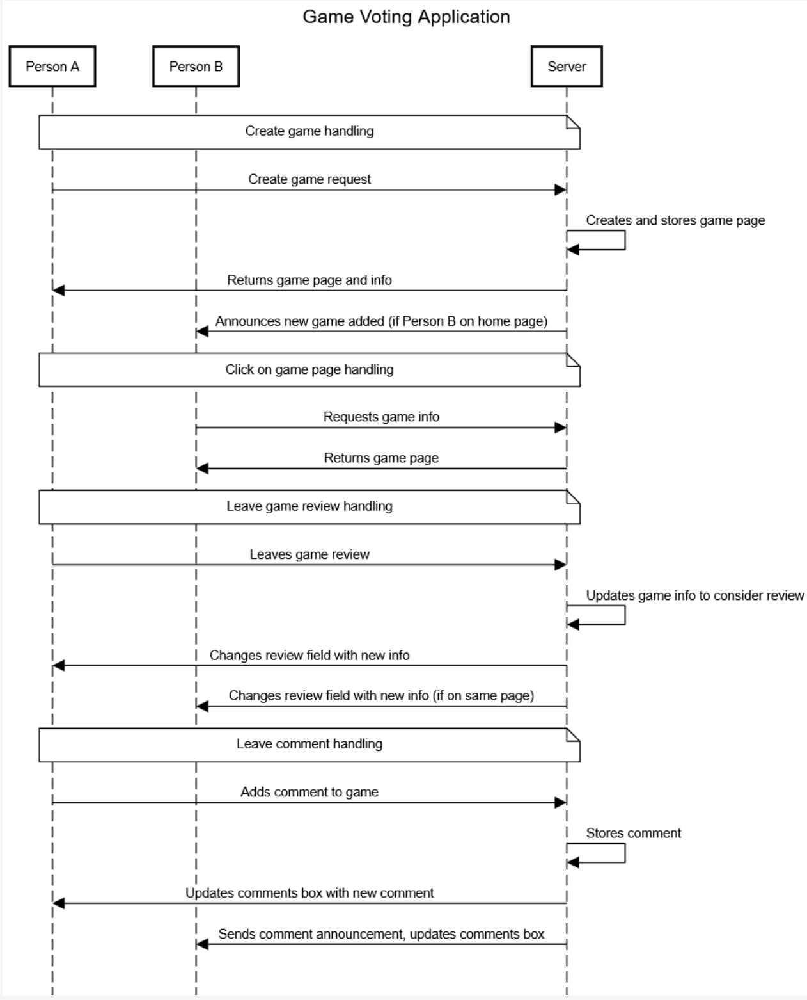

# Game Ratings and Discussion Application

Probably make the name catchier, but this works for now

[My Notes](notes.md)

# Game Ratings and Discussion Application Description:

> [!NOTE]
> This is a template for your startup application. You must modify this `README.md` file for each phase of your development. You only need to fill in the section for each deliverable when that deliverable is submitted in Canvas. Without completing the section for a deliverable, the TA will not know what to look for when grading your submission. Feel free to add additional information to each deliverable description, but make sure you at least have the list of rubric items and a description of what you did for each item.

> [!NOTE]
> If you are not familiar with Markdown then you should review the [documentation](https://docs.github.com/en/get-started/writing-on-github/getting-started-with-writing-and-formatting-on-github/basic-writing-and-formatting-syntax) before continuing.

## 🚀 Specification Deliverable

> [!NOTE]
> Fill in this sections as the submission artifact for this deliverable. You can refer to this [example](https://github.com/webprogramming260/startup-example/blob/main/README.md) for inspiration.

For this deliverable I did the following. I checked the box `[x]` and added a description for things I completed.

- [ ] Proper use of Markdown
- [x] A concise and compelling elevator pitch
- [x] Description of key features
- [x] Description of how you will use each technology
- [ ] One or more rough sketches of your application. Images must be embedded in this file using Markdown image references.

### Elevator pitch

There are a myriad of really interesting and fun video games, but there aren't actually very many good review sites. You can find reviews on Amazon, Xbox, Google, or other places but it doesn't ever seem like there are any truly dedicated locations for quality reviews. The goal of the Games Rating application is to fix this issue by providing a space for people to share their reviews and have discussions about different video games that have released. When users want to, they can open up this application and add a new game to the game options or leave a review on one that's already there. These discussions and reviews are saved so that they can be referenced in the future. Additionally an average rating for each game is displayed for concise information about opinions on the game. These will all be out of 100 so that there is plenty of room for nuanced opinions.

### Design

<small>This is the home page<small>

<small>This is a game page<small>

Above are some quick images of the home page and the game page for reference

Above this is a quick sequence diagram of several core functions involving user interactions, made very simple and summarized

### Key features

- Secure login over HTTPS
- Ability to add new games to the application
- Ability to leave a review for a game
- Ability to leave a comment on a game
- Ability for an admin to delete games, reviews, and comments
- Ability for the user to view a page for each game, with reviews and comments that are updated in real time
- Persistently stored comments, reviews, and games information
- Display of the game list
- Display of a small page with information for each game

### Technologies

I am going to use the required technologies in the following ways:

- **HTML** - Uses simple HTML structure to create small HTML pages for each game, as well as a login page. 
- **CSS** - Used to make the app look good even if screens are different sizes, as well as for formatting of pages to ensure comfortable whitespace, good spacing of images, and clear differentation of ideas in the page.
- **React** - Used for login, leaving reviews, adding new games, leaving comments, and for other miscellaneous actions and components.
- **Service** - Backend service with endpoints, including the following:
    * login
    * retrieving game information
    * submitting reviews
    * retrieving review scores
    * leaving comments
    * retrieving comments
- **DB/Login** - Store comments, votes, and game information in a database. Register and login users with securely stored credentials. People can't interact with anything other than the login page unless they are authenticated.
- **WebSocket** - When a user adds a game, leaves a review, or leaves a comment, it will be broadcast to all other users who are logged in and on the appropriate page.

## 🚀 AWS deliverable

For this deliverable I did the following. I checked the box `[x]` and added a description for things I completed.

- [ ] **Server deployed and accessible with custom domain name** - [My server link](https://yourdomainnamehere.click).

## 🚀 HTML deliverable

For this deliverable I did the following. I checked the box `[x]` and added a description for things I completed.

- [ ] **HTML pages** - I did not complete this part of the deliverable.
- [ ] **Proper HTML element usage** - I did not complete this part of the deliverable.
- [ ] **Links** - I did not complete this part of the deliverable.
- [ ] **Text** - I did not complete this part of the deliverable.
- [ ] **3rd party API placeholder** - I did not complete this part of the deliverable.
- [ ] **Images** - I did not complete this part of the deliverable.
- [ ] **Login placeholder** - I did not complete this part of the deliverable.
- [ ] **DB data placeholder** - I did not complete this part of the deliverable.
- [ ] **WebSocket placeholder** - I did not complete this part of the deliverable.

## 🚀 CSS deliverable

For this deliverable I did the following. I checked the box `[x]` and added a description for things I completed.

- [ ] **Visually appealing colors and layout. No overflowing elements.** - I did not complete this part of the deliverable.
- [ ] **Use of a CSS framework** - I did not complete this part of the deliverable.
- [ ] **All visual elements styled using CSS** - I did not complete this part of the deliverable.
- [ ] **Responsive to window resizing using flexbox and/or grid display** - I did not complete this part of the deliverable.
- [ ] **Use of a imported font** - I did not complete this part of the deliverable.
- [ ] **Use of different types of selectors including element, class, ID, and pseudo selectors** - I did not complete this part of the deliverable.

## 🚀 React part 1: Routing deliverable

For this deliverable I did the following. I checked the box `[x]` and added a description for things I completed.

- [ ] **Bundled using Vite** - I did not complete this part of the deliverable.
- [ ] **Components** - I did not complete this part of the deliverable.
- [ ] **Router** - I did not complete this part of the deliverable.

## 🚀 React part 2: Reactivity deliverable

For this deliverable I did the following. I checked the box `[x]` and added a description for things I completed.

- [ ] **All functionality implemented or mocked out** - I did not complete this part of the deliverable.
- [ ] **Hooks** - I did not complete this part of the deliverable.

## 🚀 Service deliverable

For this deliverable I did the following. I checked the box `[x]` and added a description for things I completed.

- [ ] **Node.js/Express HTTP service** - I did not complete this part of the deliverable.
- [ ] **Static middleware for frontend** - I did not complete this part of the deliverable.
- [ ] **Calls to third party endpoints** - I did not complete this part of the deliverable.
- [ ] **Backend service endpoints** - I did not complete this part of the deliverable.
- [ ] **Frontend calls service endpoints** - I did not complete this part of the deliverable.
- [ ] **Supports registration, login, logout, and restricted endpoint** - I did not complete this part of the deliverable.

## 🚀 DB deliverable

For this deliverable I did the following. I checked the box `[x]` and added a description for things I completed.

- [ ] **Stores data in MongoDB** - I did not complete this part of the deliverable.
- [ ] **Stores credentials in MongoDB** - I did not complete this part of the deliverable.

## 🚀 WebSocket deliverable

For this deliverable I did the following. I checked the box `[x]` and added a description for things I completed.

- [ ] **Backend listens for WebSocket connection** - I did not complete this part of the deliverable.
- [ ] **Frontend makes WebSocket connection** - I did not complete this part of the deliverable.
- [ ] **Data sent over WebSocket connection** - I did not complete this part of the deliverable.
- [ ] **WebSocket data displayed** - I did not complete this part of the deliverable.
- [ ] **Application is fully functional** - I did not complete this part of the deliverable.
